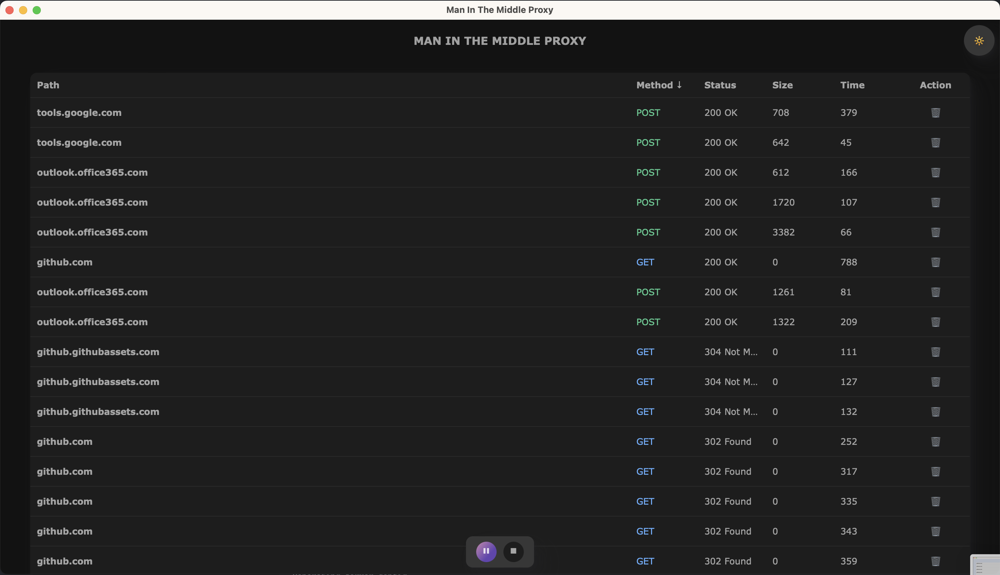
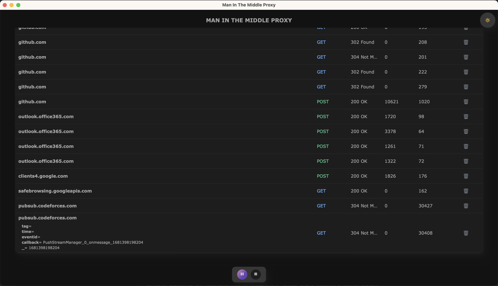
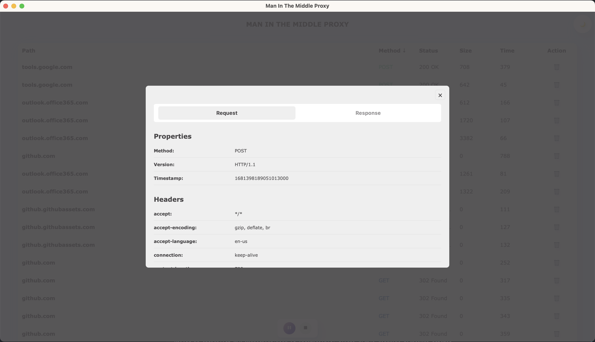

<div align="center">

<h1> Man In The Middle Proxy </h1>
</div>


[](https://github.com/emanuele-em/man-in-the-middle-proxy/actions/workflows/rust.yml)


## Description
Rust-based **Man in the Middle proxy**, an early-stage project aimed at providing visibility into network traffic. Currently, it displays both HTTP and HTTPS requests and responses, but our future goal is to allow for manipulation of the traffic for more advanced use cases.


## Features

- 🔐 HTTP / HTTP(s)
- 🖱️ Gui
- ⌨️ Possibility of choosing a customised address and listening port
- 🔍 Details for each request and response
- 🎯 Filtering the list of requests by method
- ❌ Deleting a single request from the list
- 🚫 Clear all requests and clean the table
- 🌌 Dark / light theme

## Getting Started

1. Generate a Certificate:
  - go to `~proxyapi/src/ca/`
  - start generation with following terminal command: `openssl req -x509 -newkey rsa:4096 -keyout mitmproxy.key -out mitmproxy.cer -sha256 -days 700000 -nodes`
  - You can just hit `Enter` to accept default options but keep in mind to add at least a `common name`

  

2. Install `.cer` file locally and trust it.
  - [MacOS guide](https://support.apple.com/guide/keychain-access/change-the-trust-settings-of-a-certificate-kyca11871/mac#:~:text=In%20the%20Keychain%20Access%20app,from%20the%20pop%2Dup%20menus.)
  - [Ubuntu guide](https://ubuntu.com/server/docs/security-trust-store)
  - [Windows guide](https://learn.microsoft.com/en-us/skype-sdk/sdn/articles/installing-the-trusted-root-certificate)

3. Configure your local system proxy on `127.0.0.1:8100`.
  - [MacOS guide](https://support.apple.com/it-it/guide/mac-help/mchlp2591/mac)
  - [Ubuntu guide](https://help.ubuntu.com/stable/ubuntu-help/net-proxy.html.en)
  - [Windows guide](https://support.microsoft.com/en-us/windows/use-a-proxy-server-in-windows-03096c53-0554-4ffe-b6ab-8b1deee8dae1#:~:text=a%20VPN%20connection-,Select%20the%20Start%20button%2C%20then%20select%20Settings%20%3E%20Network%20%26%20Internet,information%20for%20that%20VPN%20connection.)

## Start Development
```bash
cargo tauri dev
```

## Documentation and Help

If you have questions on how to use [Man In The Middle Proxy](https://github.com/emanuele-em/man-in-the-middle-proxy), please use GitHub Discussions!


## Contributing

Contributions are always welcome!

See `contributing.md` for ways to get started.

Please adhere to this project's `code of conduct`.


## Licenses

See [LICENSE-APACHE](LICENSE-APACHE), [LICENSE-MIT](LICENSE-MIT) for details

## Screenshots

### Input of Listening Address


### Requests List





### Request and Response Details




